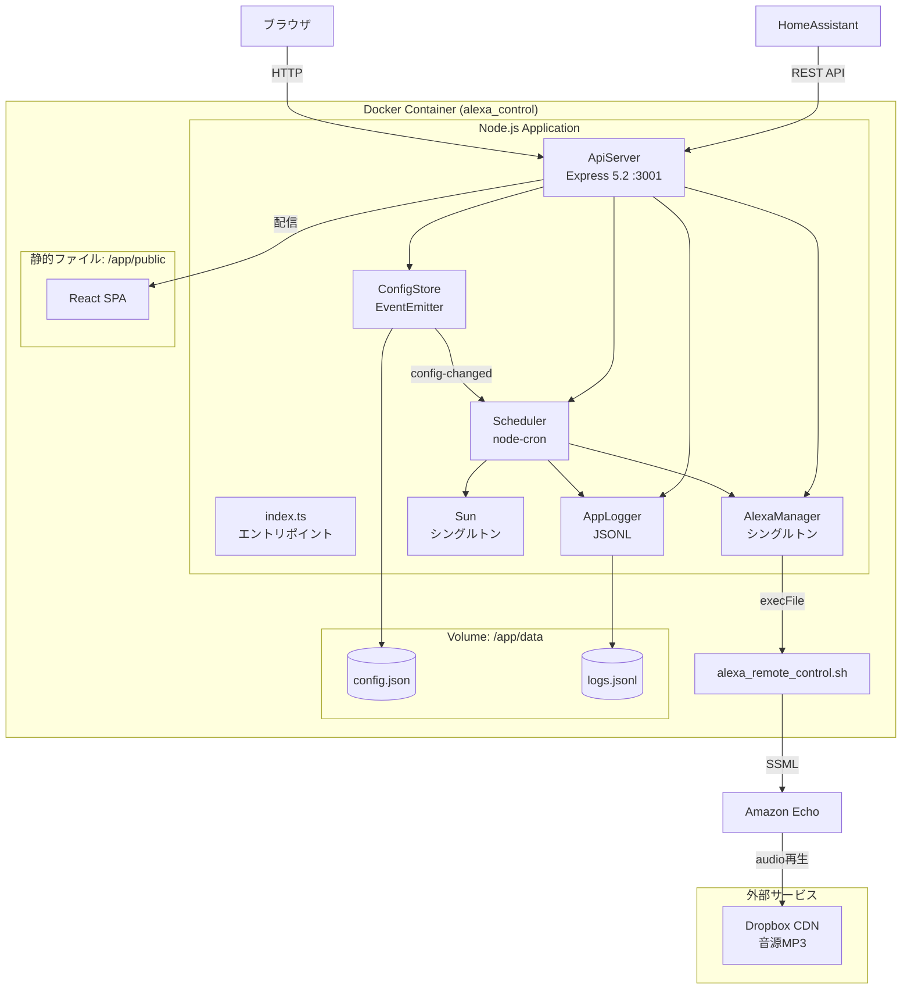
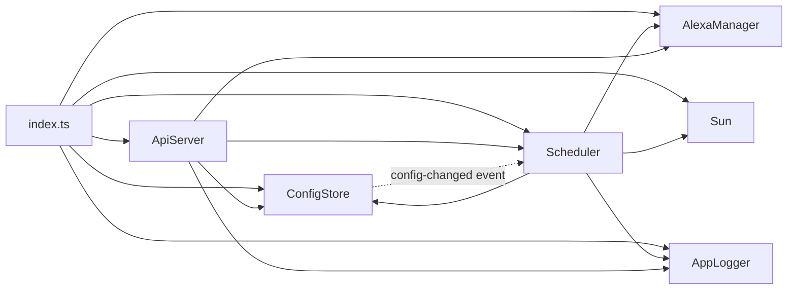
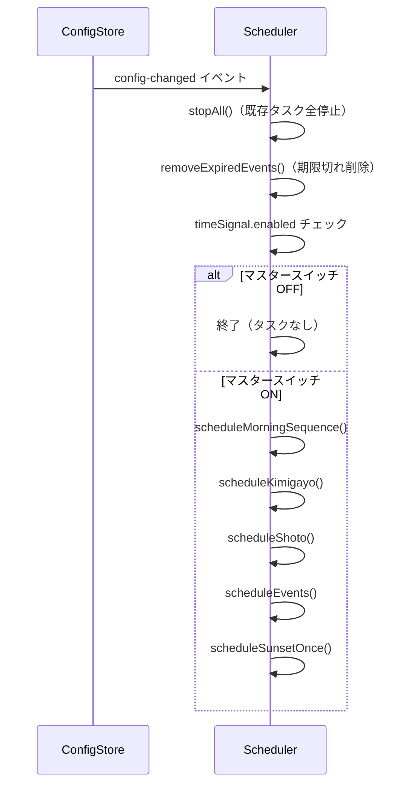
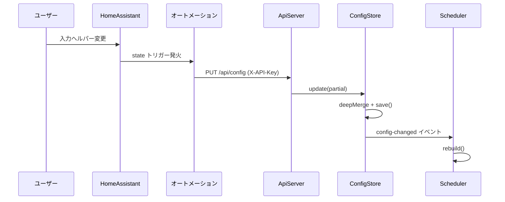
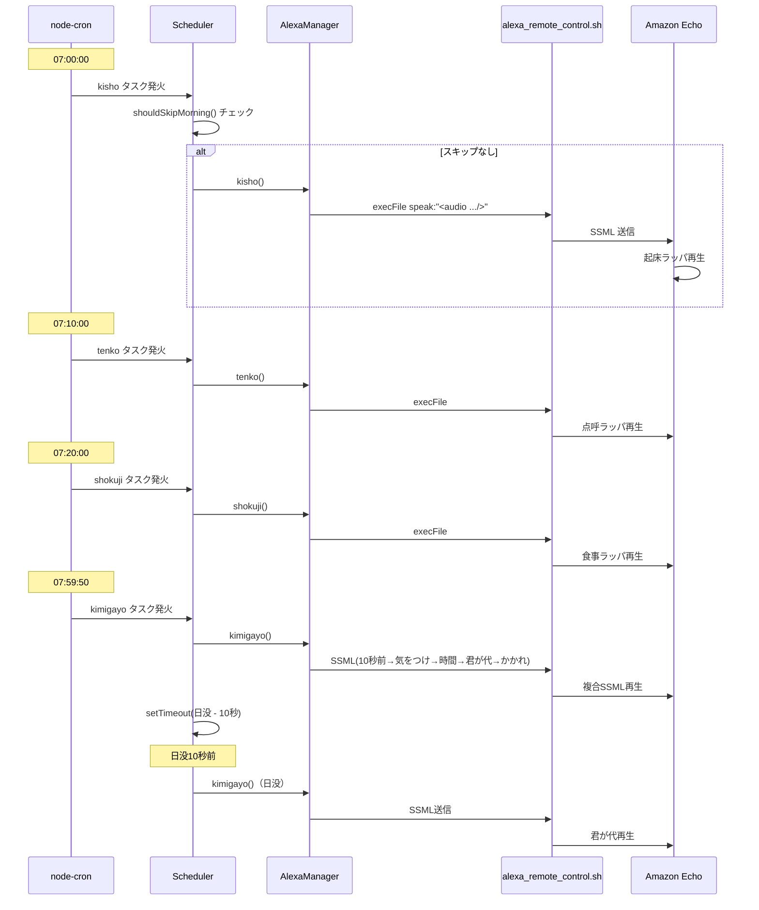
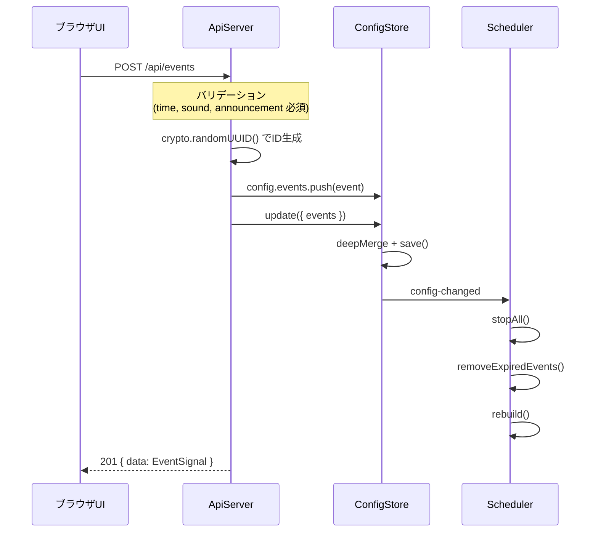

# 設計書

## 文書情報

| 項目 | 内容 |
|------|------|
| 文書名 | Alexa時報システム 設計書 |
| プロジェクト名 | alexa_timesignal |
| バージョン | 2.1.0 |
| 作成日 | 2026-06-21 |

---

## 1. システム構成

### 1.1 全体アーキテクチャ



### 1.2 技術スタック

| 層 | 技術 | バージョン |
|---|------|-----------|
| ランタイム | Node.js | 20 (bullseye-slim) |
| 言語 | TypeScript | 5.3 |
| Webフレームワーク | Express | 5.2 |
| スケジューラー | node-cron | 3.0 |
| フロントエンド | React | 18.3 |
| UIライブラリ | Material-UI | 5.15 |
| ビルドツール | Vite | 5.3 |
| 日没計算 | suncalc | 1.9 |
| 祝日判定 | @holiday-jp/holiday_jp | 2.5 |
| コンテナ | Docker | node:20-bullseye-slim |

---

## 2. モジュール設計

### 2.1 ファイル構成

```
alexa-controller-app/
├── src/
│   ├── index.ts          # エントリポイント
│   ├── types.ts          # 型定義
│   ├── config-store.ts   # 設定管理
│   ├── alexa-manager.ts  # Alexa制御
│   ├── scheduler.ts      # スケジューラー
│   ├── api-server.ts     # REST APIサーバー
│   ├── sun.ts            # 日没計算
│   └── logger.ts         # ログ管理
├── client/
│   └── src/
│       ├── App.tsx       # メインコンポーネント
│       ├── main.tsx      # エントリポイント
│       └── types.ts      # フロント型定義 + SOUND_LABELS
├── Dockerfile
└── package.json
```

### 2.2 コンポーネント依存関係



### 2.3 index.ts（エントリポイント）

**責務**: 環境変数の検証、各モジュールの初期化、起動モードの制御

**初期化順序**:
1. `dotenv/config` による環境変数読み込み
2. 音源パス環境変数の検証（10個必須、未設定時は `process.exit(1)`）
3. 緯度経度の検証（未設定時は `process.exit(1)`）
4. `ConfigStore` 生成 → `load()`
5. `AppLogger` 生成
6. `AlexaManager.getInstance()`（シングルトン取得）
7. `Sun.getInstance()`（シングルトン取得）
8. `Scheduler` 生成（ConfigStore, AlexaManager, Sun, AppLogger を注入）
9. `ApiServer` 生成 → `listen()`
10. モード別初期処理の実行

**起動モード分岐**:

```
START_MODE === 'dev'
  → teijitenken() → 10秒後 shokuji()

START_MODE !== 'dev' (prod)
  → uchikatahajime() → 10秒後 scheduler.rebuild()
```

### 2.4 ConfigStore（設定管理）

**ファイル**: `src/config-store.ts`

**クラス設計**:
- `EventEmitter` を継承
- 設定変更時に `config-changed` イベントを発行

**デフォルト設定（DEFAULT_CONFIG）**:

```typescript
{
  wakeUp: { enabled: true },
  timeSignal: { enabled: true },
  shoto: { enabled: true, time: '23:00' },
  stopPeriod: { enabled: false, startDate: '', endDate: '', startTime: '00:00', endTime: '23:59' },
  nextWakeUp: { enabled: false, date: '', time: '07:00' },
  events: [],
}
```

**主要メソッド**:

| メソッド | 説明 |
|---------|------|
| `load()` | ファイル読み込み。存在しない場合はデフォルトで初期化・保存 |
| `save()` | 一時ファイル（`.tmp`）に書き込み後、`rename` で原子的に置換 |
| `get()` | 設定のディープコピーを返却（外部からの直接変更を防止） |
| `update(partial)` | `deepMerge` で部分更新 → `save()` → `config-changed` イベント発行 |

**deepMerge の挙動**:
- オブジェクト同士: 再帰的にマージ
- 配列: マージではなく**置換**（events 配列の更新で重要）
- `undefined` の値: スキップ（既存値を維持）

### 2.5 AlexaManager（Alexa制御）

**ファイル**: `src/alexa-manager.ts`

**クラス設計**:
- シングルトンパターン（`getInstance()`）
- コンストラクタで15個の音源URLを環境変数から取得

**Alexa通信**:

```
AlexaManager.speak(message)
  → execFile('/app/alexa_remote_control.sh', ['-e', 'speak:"<SSML>"'])
  → リトライ（MAX_RETRIES=2, 3秒間隔）
  → 成功: stdout を返却 / 失敗: Error をスロー
```

**公開メソッド**:

| メソッド | 音源 | SSML構造 |
|---------|------|----------|
| `kimigayo()` | kiotsuke + kimigayo + kakare | 複合（emotion + audio + break） |
| `syukkou()` | syukkou | 単純（audio のみ） |
| `kisho()` | kisho | 単純 |
| `tenko()` | tenko | 単純 |
| `shokuji()` | shokuji | 単純 |
| `shoto()` | shoto | 単純 |
| `teijitenken()` | teijitenken | 単純（dev用） |
| `uchikatahajime()` | uchikatahazime | 単純（prod起動用） |
| `speakWithSound(sound, announcement)` | サイドパイプ | audio + emotion + prosody |

**SSML構造例（君が代）**:

```xml
<amazon:emotion name='excited'>
    <prosody volume='x-fast'>10秒前</prosody>
</amazon:emotion>
<audio src='{kiotsuke_url}'/>
<break time='4s'/>
<amazon:emotion name='excited'>
    <prosody volume='x-fast'>時間</prosody>
</amazon:emotion>
<break strength='strong'/>
<audio src='{kimigayo_url}'/>
<break time='1s'/>
<amazon:emotion name='excited'>
    <prosody volume='x-fast'>かかれ</prosody>
</amazon:emotion>
<audio src='{kakare_url}'/>
```

**SSML構造例（イベント時報 speakWithSound）**:

```xml
<audio src='{side_pipe_url}'/>
<amazon:emotion name='excited'>
    <prosody volume='x-fast'>{announcement}</prosody>
</amazon:emotion>
```

### 2.6 Scheduler（スケジューラー）

**ファイル**: `src/scheduler.ts`

**クラス設計**:
- `ScheduledTask[]` 配列で cron タスクを管理
- `sunsetTimeout` で日没スケジュールを管理（setTimeout）
- コンストラクタで `config-changed` イベントをリッスンし、自動で `rebuild()` を呼び出す

**スケジュール構築フロー（rebuild）**:



**スケジュール関数一覧**:

| 関数 | cron式 | 内容 |
|------|--------|------|
| `scheduleMorningSequence` | `0 {M} {H} * * *` × 3 | 起床/点呼/食事（config.wakeUp.defaultTime 基準） |
| `scheduleKimigayo` | `50 59 7 * * *` | 朝の君が代（07:59:50固定）+ 日没スケジュール予約 |
| `scheduleShoto` | `0 {M} {H} * * *` | 消灯ラッパ（config.shoto.time） |
| `scheduleEvents` | `0 {M} {H} * * *` × N | 有効なイベント毎にタスク作成 |
| `scheduleSunsetOnce` | `setTimeout` | 起動時の日没スケジュール（suncalcで計算） |

**スキップ判定**:

| メソッド | チェック内容 |
|---------|------------|
| `shouldSkipToday(config)` | 停止期間内かどうか（startDate/endDate + startTime/endTime） |
| `shouldSkipMorning(config)` | `shouldSkipToday` → nextWakeUpが今日なら実行 → それ以外は週末・祝日でスキップ |
| `isNextWakeUpToday(config)` | nextWakeUp.enabled かつ nextWakeUp.date が今日と一致するか |

**次回起床オーバーライド**:
- `getMorningBaseTime(config)`: nextWakeUpが今日なら `nextWakeUp.time`、それ以外は `defaultTime` を返す
- `clearNextWakeUp()`: 食事ラッパ実行後にオーバーライドを自動クリア（enabled=false, date='', time='07:00'）

**getNextSignals()**: 今日の残りスケジュールを時刻順で返却。残りがない場合は翌日のスケジュールを「(翌日)」付きで返却。

### 2.7 ApiServer（REST APIサーバー）

**ファイル**: `src/api-server.ts`

**クラス設計**:
- Express 5.2 アプリケーション
- CORS 有効、JSON ボディパーサー有効
- `public/` ディレクトリから静的ファイル配信
- SPA フォールバック: `/{*path}` → `index.html`

**認証ミドルウェア**:
- `X-API-Key` ヘッダーの値を `HA_API_KEY` 環境変数と比較
- 不一致時: `401 Unauthorized`

**バリデーション（イベント作成時）**:
- `time`, `sound`, `announcement` は必須（不足時: `400`）
- `sound` は `['zarei', 'tanfu', 'souin', 'wakare', 'genmon_sougei']` のいずれか（不正値時: `400`）

### 2.8 Sun（日没計算）

**ファイル**: `src/sun.ts`

**クラス設計**:
- シングルトンパターン（`getInstance()`）
- 環境変数 `MY_LATITUDE`, `MY_LONGITUDE` から座標を取得

**メソッド**:

| メソッド | 戻り値 | 説明 |
|---------|--------|------|
| `getSunsetIntervalTime()` | `Promise<number>` | 現在時刻から日没までのミリ秒 |
| `getSunsetTimeString()` | `string` | 日没時刻を `HH:MM` 形式で返却 |

### 2.9 AppLogger（ログ管理）

**ファイル**: `src/logger.ts`

**クラス設計**:
- ファイルパス: `{DATA_DIR}/logs.jsonl`
- ディレクトリが存在しない場合は自動作成

**メソッド**:

| メソッド | 説明 |
|---------|------|
| `log(type, message, details?)` | JSONL形式でファイルに追記 → トリム判定 |
| `query(limit, offset)` | 逆順（新しい順）で `limit` 件取得、`total` 付き |

**トリム処理**: 書き込みのたびに行数チェック。1,000行超過時に最新500行を残して上書き。

---

## 3. API仕様

### 3.1 GET /api/config

設定の全体を取得する。

| 項目 | 値 |
|------|-----|
| 認証 | 必須 |
| レスポンス | `{ data: AppConfig }` |

### 3.2 PUT /api/config

設定を部分更新する。deepMerge により指定したフィールドのみ更新される。

| 項目 | 値 |
|------|-----|
| 認証 | 必須 |
| リクエストボディ | `Partial<AppConfig>` |
| レスポンス | `{ data: AppConfig }` |
| エラー | `400`: 更新処理エラー |

### 3.3 GET /api/status

システムの稼働状態と次の時報予定を取得する。

| 項目 | 値 |
|------|-----|
| 認証 | 必須 |
| レスポンス | 下記参照 |

```json
{
  "active": true,
  "stopPeriodActive": false,
  "nextWakeUpActive": false,
  "nextSignals": [
    { "time": "07:59", "name": "君が代（朝）" },
    { "time": "23:00", "name": "消灯ラッパ" }
  ],
  "nextSignalName": "君が代（朝）",
  "nextSignalTime": "07:59"
}
```

### 3.4 POST /api/test-signal

サイドパイプ音源をテスト再生する。

| 項目 | 値 |
|------|-----|
| 認証 | 必須 |
| リクエストボディ | `{ sound: string, announcement?: string }` |
| レスポンス | `{ success: true }` |
| エラー | `400`: sound 未指定 / `500`: Alexa通信失敗 |

### 3.5 GET /api/events

登録済みイベントの一覧を取得する。

| 項目 | 値 |
|------|-----|
| 認証 | 不要 |
| レスポンス | `{ data: EventSignal[] }` |

### 3.6 POST /api/events

新しいイベントを作成する。

| 項目 | 値 |
|------|-----|
| 認証 | 不要 |
| リクエストボディ | `{ time, sound, announcement, recurring?, date?, enabled? }` |
| レスポンス | `201 { data: EventSignal }` |
| エラー | `400`: 必須フィールド不足 or 不正な sound 値 |

**バリデーション**:
- `time`, `sound`, `announcement` は必須
- `sound` は `zarei`, `tanfu`, `souin`, `wakare`, `genmon_sougei` のいずれか
- `enabled` 省略時: `true`
- `recurring` 省略時: `true`
- `id` は `crypto.randomUUID()` で自動生成

### 3.7 PUT /api/events/:id

既存イベントを部分更新する。

| 項目 | 値 |
|------|-----|
| 認証 | 不要 |
| リクエストボディ | `Partial<EventSignal>` |
| レスポンス | `{ data: EventSignal }` |
| エラー | `404`: イベント未検出 |

### 3.8 DELETE /api/events/:id

イベントを削除する。

| 項目 | 値 |
|------|-----|
| 認証 | 不要 |
| レスポンス | `{ success: true }` |
| エラー | `404`: イベント未検出 |

### 3.9 GET /api/logs

操作ログを取得する。

| 項目 | 値 |
|------|-----|
| 認証 | 不要 |
| クエリパラメータ | `limit`（デフォルト50）, `offset`（デフォルト0） |
| レスポンス | `{ data: LogEntry[], total: number }` |

---

## 4. データ設計

### 4.1 config.json スキーマ

```typescript
interface AppConfig {
    wakeUp: {
        enabled: boolean;         // 起床シーケンス有効化（時刻は07:00固定）
    };
    timeSignal: {
        enabled: boolean;         // マスタースイッチ（デフォルト: true）
    };
    shoto: {
        enabled: boolean;         // 消灯ラッパ有効化（デフォルト: true）
        time: string;             // HH:MM 形式（デフォルト: "23:00"）
    };
    stopPeriod: {
        enabled: boolean;         // 停止期間有効化（デフォルト: false）
        startDate: string;        // YYYY-MM-DD（デフォルト: ""）
        endDate: string;          // YYYY-MM-DD（デフォルト: ""）
        startTime: string;        // HH:MM（デフォルト: "00:00"）
        endTime: string;          // HH:MM（デフォルト: "23:59"）
    };
    nextWakeUp: {
        enabled: boolean;         // 次回オーバーライド有効化（デフォルト: false）
        date: string;             // YYYY-MM-DD（デフォルト: ""）
        time: string;             // HH:MM（デフォルト: "07:00"）
    };
    events: EventSignal[];        // イベント時報の配列（デフォルト: []）
}
```

### 4.2 EventSignal スキーマ

```typescript
type SidePipeSound = 'zarei' | 'tanfu' | 'souin' | 'wakare' | 'genmon_sougei';

interface EventSignal {
    id: string;              // UUID（crypto.randomUUID()で生成）
    enabled: boolean;        // 有効/無効
    time: string;            // HH:MM 形式
    sound: SidePipeSound;    // サイドパイプ音源
    announcement: string;    // 号令テキスト
    recurring: boolean;      // true: 毎日 / false: 単発
    date?: string;           // YYYY-MM-DD（単発イベントの実行日）
}
```

### 4.3 LogEntry スキーマ

```typescript
interface LogEntry {
    timestamp: string;        // ISO 8601 形式
    type: 'signal' | 'config_change' | 'error' | 'system';
    message: string;
    details?: Record<string, unknown>;
}
```

**ログエントリ例**:

```jsonl
{"timestamp":"2026-06-21T07:00:00.000Z","type":"signal","message":"起床ラッパ (07:00)"}
{"timestamp":"2026-06-21T07:59:50.000Z","type":"signal","message":"君が代（朝）"}
{"timestamp":"2026-06-21T08:55:00.000Z","type":"signal","message":"イベント時報: 出港用意 5分前 (zarei)"}
{"timestamp":"2026-06-21T23:00:00.000Z","type":"config_change","message":"設定が更新されました"}
```

### 4.4 環境変数一覧

| 変数名 | 必須 | デフォルト | 説明 |
|--------|------|-----------|------|
| `SET_REFRESH_TOKEN` | - | - | Alexaリフレッシュトークン |
| `AUDIO_SYUKKOU_PATH` | 必須 | - | 出港ラッパ音源URL |
| `AUDIO_KIOTSUKE_PATH` | 必須 | - | 気をつけラッパ音源URL |
| `AUDIO_KIMIGAYO_PATH` | 必須 | - | 君が代音源URL |
| `AUDIO_KAKARE_PATH` | 必須 | - | かかれラッパ音源URL |
| `AUDIO_TEIJITENKEN_PATH` | 必須 | - | 定時点検ラッパ音源URL |
| `AUDIO_UCHIKATAHAZIME_PATH` | 必須 | - | 撃ち方始めラッパ音源URL |
| `AUDIO_SHOTO_PATH` | 必須 | - | 消灯ラッパ音源URL |
| `AUDIO_KISHO_PATH` | 必須 | - | 起床ラッパ音源URL |
| `AUDIO_TENKO_PATH` | 必須 | - | 点呼ラッパ音源URL |
| `AUDIO_SHOKUJI_PATH` | 必須 | - | 食事ラッパ音源URL |
| `AUDIO_ZAREI_PATH` | 任意 | `""` | 雑令音源URL |
| `AUDIO_TANFU_PATH` | 任意 | `""` | 短符音源URL |
| `AUDIO_SOUIN_PATH` | 任意 | `""` | 総員音源URL |
| `AUDIO_WAKARE_PATH` | 任意 | `""` | 別れ音源URL |
| `AUDIO_GENMON_SOUGEI_PATH` | 任意 | `""` | 舷門送迎音源URL |
| `MY_LATITUDE` | 必須 | - | 日没計算用の緯度 |
| `MY_LONGITUDE` | 必須 | - | 日没計算用の経度 |
| `START_MODE` | 任意 | `"dev"` | 起動モード（dev / prod） |
| `DATA_DIR` | 任意 | `"/app/data"` | データディレクトリパス |
| `API_PORT` | 任意 | `"3001"` | APIサーバーポート番号 |
| `HA_API_KEY` | 任意 | `"default-api-key"` | API認証キー |

---

## 5. フロントエンド設計

### 5.1 技術構成

| 項目 | 内容 |
|------|------|
| フレームワーク | React 18.3 |
| UIライブラリ | Material-UI (MUI) 5.15 |
| ビルドツール | Vite 5.3 |
| 言語 | TypeScript 5.2 |
| テーマカラー | primary: `#1a237e`（ネイビー）, secondary: `#b71c1c` |
| フォント | Noto Sans JP |

### 5.2 コンポーネント構成

**App（`client/src/App.tsx`）**

単一コンポーネントで以下の機能を提供:

| 機能 | UIコンポーネント | 説明 |
|------|----------------|------|
| イベント一覧 | `List` + `Paper` | 各イベントをカード形式で表示 |
| 有効/無効トグル | `Switch` | イベントの ON/OFF 切り替え |
| 音源ラベル | `Chip` | SOUND_LABELS を表示 |
| 削除ボタン | `IconButton` + `DeleteIcon` | イベント削除 |
| 追加ボタン | `Fab` + `AddIcon` | 画面右下の固定ボタン |
| 追加ダイアログ | `Dialog` | 時刻/音源/号令/繰り返し入力 |
| 通知 | `Snackbar` + `Alert` | 操作結果の表示（3秒後自動消去） |
| 空状態 | `Paper` | 「イベントが登録されていません」 |

**SOUND_LABELS（`client/src/types.ts`）**:

```typescript
const SOUND_LABELS: Record<SidePipeSound, string> = {
    zarei: '雑令',
    tanfu: '短符',
    souin: '総員',
    wakare: '別れ',
    genmon_sougei: '舷門送迎',
};
```

### 5.3 API通信

- `API_BASE = ''`（同一オリジン）
- `fetch` による REST API 呼び出し
- `Content-Type: application/json` を自動付与
- エラー時はレスポンスの `message` フィールドを表示

### 5.4 ビルドとデプロイ

```
client/ ─── npm run build ──→ ../public/ ──→ Express.static で配信
                (vite build)
```

- Vite の `outDir` を `../public` に設定
- 開発時は Vite dev サーバーの proxy で `/api` を `localhost:3001` に転送
- 本番時は Express がビルド済み静的ファイルを配信

---

## 6. HomeAssistant統合設計

### 6.1 入力ヘルパー

**configuration.yaml で定義**:

| Entity | 型 | 初期値 |
|--------|-----|--------|
| `input_boolean.alexa_timesignal_enabled` | Boolean | ON |
| `input_boolean.alexa_kisho_enabled` | Boolean | ON |
| `input_boolean.alexa_shoto_enabled` | Boolean | ON |
| `input_boolean.alexa_stop_period_enabled` | Boolean | OFF |
| `input_boolean.alexa_next_wakeup_enabled` | Boolean | OFF |
| `input_datetime.alexa_next_wakeup_datetime` | DateTime | - |
| `input_datetime.alexa_shoto_time` | Time | 23:00 |
| `input_datetime.alexa_stop_start` | DateTime | - |
| `input_datetime.alexa_stop_end` | DateTime | - |
| `input_datetime.alexa_next_wakeup_datetime` | DateTime | - |

### 6.2 RESTセンサー

```yaml
rest:
  - resource: http://<IP>:3001/api/status
    headers:
      X-API-Key: !secret alexa_api_key
    scan_interval: 60
    sensor:
      - name: Alexa時報ステータス
        value_template: "{{ value_json.nextSignalName }}"
        json_attributes:
          - active
          - stopPeriodActive
          - nextSignals
          - nextSignalTime
```

### 6.3 RESTコマンド

```yaml
rest_command:
  alexa_update_config:
    url: http://<IP>:3001/api/config
    method: PUT
    headers:
      X-API-Key: !secret alexa_api_key
    payload: >-
      {
        "timeSignal": { "enabled": {{ states('input_boolean.alexa_timesignal_enabled') == 'on' | lower }} },
        "wakeUp": { "enabled": {{ ... }}, "defaultTime": "{{ ... }}" },
        "shoto": { "enabled": {{ ... }}, "time": "{{ ... }}" },
        "stopPeriod": { "enabled": {{ ... }}, ... },
        "nextWakeUp": { "enabled": {{ ... }}, "date": "{{ ... }}", "time": "{{ ... }}" }
      }
```

### 6.4 オートメーション

```yaml
- id: alexa_timesignal_sync
  alias: Alexa時報 設定同期
  triggers:
    - trigger: state
      entity_id:
        - input_boolean.alexa_timesignal_enabled
        - input_boolean.alexa_kisho_enabled
        - input_boolean.alexa_shoto_enabled
        - input_boolean.alexa_stop_period_enabled
        - input_datetime.alexa_kisho_time
        - input_datetime.alexa_shoto_time
        - input_datetime.alexa_stop_start
        - input_datetime.alexa_stop_end
  actions:
    - action: rest_command.alexa_update_config
```

### 6.5 ダッシュボード

- **Entitiesカード**: 入力ヘルパーのトグル・時刻設定 + ステータスセンサー表示
- **iframeパネル**: `http://<IP>:3001` をイベント管理画面として埋め込み（`mdi:bugle` アイコン）

### 6.6 設定同期フロー



---

## 7. デプロイ構成

### 7.1 Dockerfile

```dockerfile
FROM node:20-bullseye-slim

ENV LANG=ja_JP.UTF-8
ENV TZ=Asia/Tokyo

RUN apt-get update && apt-get install -y curl jq oathtool

WORKDIR /app

# バックエンド依存インストール
COPY package.json package-lock.json tsconfig.json ./
RUN npm install
COPY src/ ./src/
COPY alexa_remote_control.sh ./
RUN chmod +x ./alexa_remote_control.sh

# フロントエンドビルド
COPY client/ ./client/
RUN cd /app/client && npm install && npm run build

# TypeScriptコンパイル
RUN npm run build

EXPOSE 3001
CMD ["npm", "run", "start"]
```

### 7.2 docker-compose.yml

```yaml
services:
  alexa_control:
    build: ./alexa-controller-app
    container_name: alexa_control
    restart: unless-stopped
    env_file:
      - ./.env
    environment:
      SET_REFRESH_TOKEN: "${SET_REFRESH_TOKEN}"
    ports:
      - "3001:3001"
    volumes:
      - ./data:/app/data
    healthcheck:
      test: ["CMD-SHELL", "curl -f http://localhost:3001/api/status -H \"X-API-Key: $${HA_API_KEY}\" || exit 1"]
      interval: 60s
      timeout: 10s
      retries: 3
      start_period: 30s
```

### 7.3 ボリュームマウント

| ホスト | コンテナ | 用途 |
|--------|---------|------|
| `./data` | `/app/data` | config.json, logs.jsonl の永続化 |

---

## 8. シーケンス図

### 8.1 朝の時報シーケンス



### 8.2 イベント追加フロー


